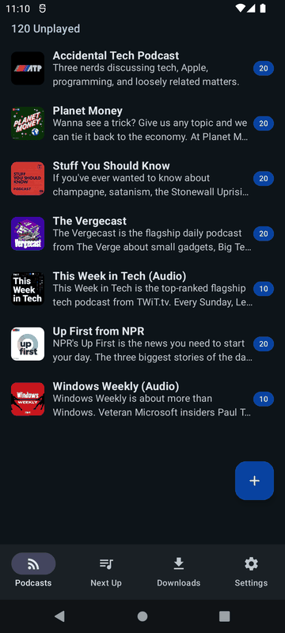
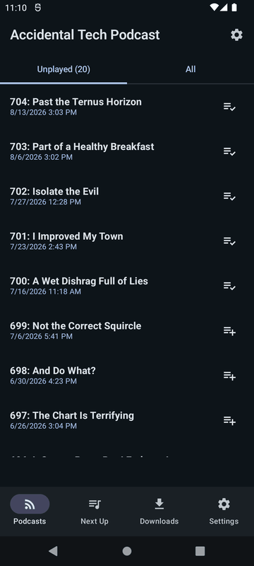
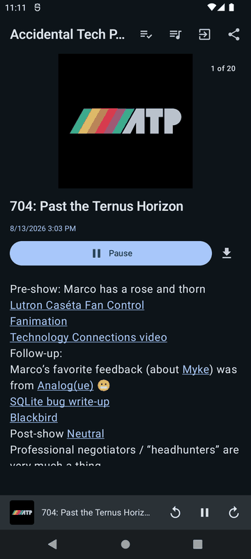
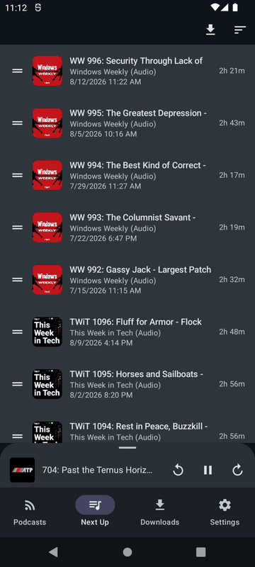
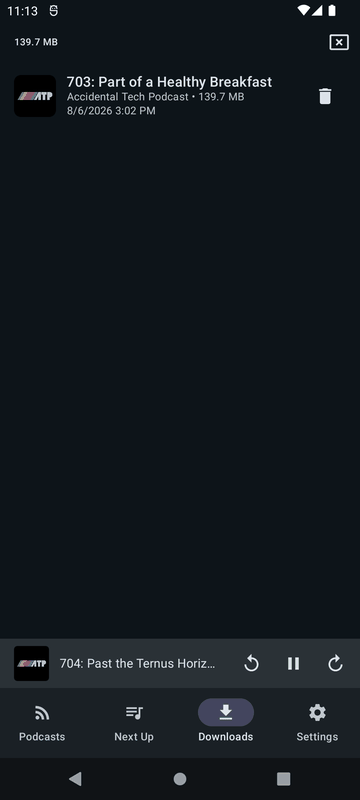
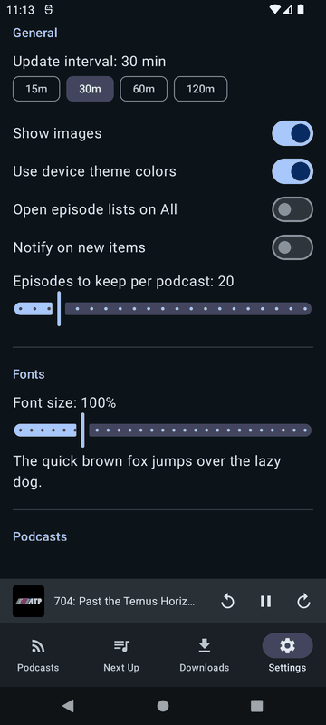

# User guide

A walkthrough of MyCasts, a native Android podcast client. Screenshots below were taken from a
release build running on an emulator in dark mode, using the app's built-in starter feeds.

## Getting started

On first launch, with no subscriptions yet, MyCasts offers to add a curated set of starter feeds
so there's something to browse right away. You can add or remove feeds at any time — this is
just a shortcut to skip typing in URLs one at a time.

## Podcasts

The Podcasts tab lists every feed you're subscribed to, with unread counts per feed and a total
unread count at the top. Tap a feed to see its episodes; tap **+** to add a new one by searching
or pasting a feed URL.

Inside a feed, episodes are split into **Unplayed** and **All** tabs, newest first. Each row has
a queue button to add the episode to Next Up.

Tapping an episode opens its details: show notes, a **Play**/**Pause** button, and a download
button. While playing, a mini-player stays pinned to the bottom of the screen so you can keep
browsing other feeds without losing playback controls.

## Next Up

The Next Up tab is a play-next queue. Episodes added from any feed's episode list land here,
reorderable by dragging, with each entry's remaining runtime shown.

## Downloads

Any episode can be downloaded for offline playback from its details screen. The Downloads tab
lists everything downloaded so far, with the total storage used at the top and a delete action
per episode.

## Settings

Settings covers feed refresh interval, whether episode images are shown, font size (with a live
preview), how many episodes to keep per podcast, and further sections below for playback and
podcast-specific defaults.

## Home screen widget

MyCasts also provides a home-screen widget showing unread counts per feed, refreshed whenever the
app opens or a scheduled feed refresh runs. Tapping a feed in the widget opens that feed's
episode list directly.
